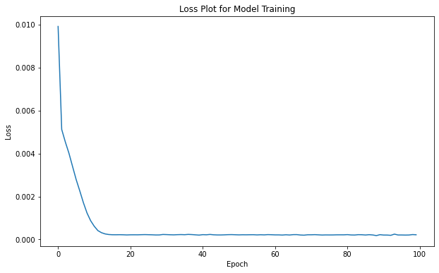
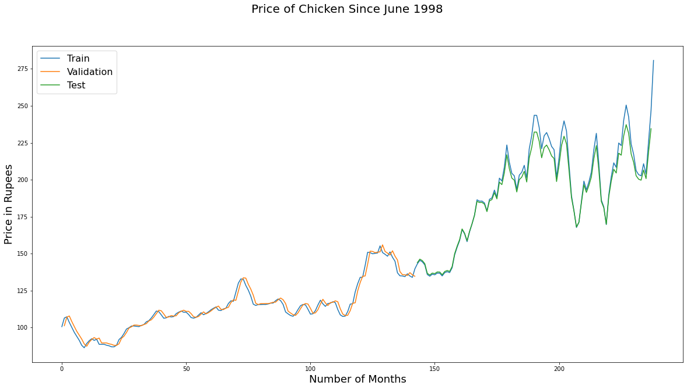

```python
import numpy
import matplotlib.pyplot as plt
from pandas import read_csv
import math
from keras.models import Sequential
from keras.layers import Dense
from keras.layers import LSTM
from sklearn.preprocessing import MinMaxScaler
from sklearn.metrics import mean_squared_error
%matplotlib inline
```

    Using TensorFlow backend.
    


```python
# convert an array of values into a dataset matrix
def create_dataset(dataset, look_back=1):
    dataX, dataY = [], []
    for i in range(len(dataset)-look_back):
        a = dataset[i:(i+look_back), 0]
        dataX.append(a)
        dataY.append(dataset[i + look_back, 0])
    return numpy.array(dataX), numpy.array(dataY)
```


```python
# fix random seed for reproducibility
numpy.random.seed(3)
```


```python
# load the dataset
dataframe = read_csv('Datasets.csv', usecols=[1], engine='python')
dataset = dataframe.values
dataset = dataset.astype('float32')
```


```python
# normalize the dataset
scaler = MinMaxScaler(feature_range=(0, 1))
dataset = scaler.fit_transform(dataset)
```


```python
# split into train and test sets
train_size = int(len(dataset) * 0.60)
test_size = len(dataset) - train_size
train, test = dataset[0:train_size,:], dataset[train_size:len(dataset),:]
```


```python
# reshape into X=t and Y=t+1
look_back = 1
trainX, trainY = create_dataset(train, look_back)
testX, testY = create_dataset(test, look_back)
```


```python
# reshape input to be [samples, time steps, features]
trainX = numpy.reshape(trainX, (trainX.shape[0], 1, trainX.shape[1]))
testX = numpy.reshape(testX, (testX.shape[0], 1, testX.shape[1]))
```


```python
# create and fit the LSTM network
model = Sequential()
model.add(LSTM(4, input_shape=(1, look_back)))
model.add(Dense(1))
model.compile(loss='mean_squared_error', optimizer='adam')
h = model.fit(trainX, trainY, epochs=100, batch_size=1, verbose=2)
```

    Epoch 1/100
     - 1s - loss: 0.0099
    Epoch 2/100
     - 0s - loss: 0.0051
    Epoch 3/100
     - 0s - loss: 0.0045
    Epoch 4/100
     - 0s - loss: 0.0040
    Epoch 5/100
     - 0s - loss: 0.0034
    Epoch 6/100
     - 0s - loss: 0.0028
    Epoch 7/100
     - 0s - loss: 0.0023
    Epoch 8/100
     - 0s - loss: 0.0017
    Epoch 9/100
     - 0s - loss: 0.0012
    Epoch 10/100
     - 0s - loss: 8.7153e-04
    Epoch 11/100
     - 0s - loss: 6.1272e-04
    Epoch 12/100
     - 0s - loss: 4.1161e-04
    Epoch 13/100
     - 0s - loss: 3.1456e-04
    Epoch 14/100
     - 0s - loss: 2.5733e-04
    Epoch 15/100
     - 0s - loss: 2.2869e-04
    Epoch 16/100
     - 0s - loss: 2.1899e-04
    Epoch 17/100
     - 0s - loss: 2.1782e-04
    Epoch 18/100
     - 0s - loss: 2.2092e-04
    Epoch 19/100
     - 0s - loss: 2.1717e-04
    Epoch 20/100
     - 0s - loss: 2.0975e-04
    Epoch 21/100
     - 0s - loss: 2.1600e-04
    Epoch 22/100
     - 0s - loss: 2.1694e-04
    Epoch 23/100
     - 0s - loss: 2.1551e-04
    Epoch 24/100
     - 0s - loss: 2.2109e-04
    Epoch 25/100
     - 0s - loss: 2.2503e-04
    Epoch 26/100
     - 0s - loss: 2.2043e-04
    Epoch 27/100
     - 0s - loss: 2.1632e-04
    Epoch 28/100
     - 0s - loss: 2.0847e-04
    Epoch 29/100
     - 0s - loss: 2.0972e-04
    Epoch 30/100
     - 0s - loss: 2.3105e-04
    Epoch 31/100
     - 0s - loss: 2.2528e-04
    Epoch 32/100
     - 0s - loss: 2.1800e-04
    Epoch 33/100
     - 0s - loss: 2.1391e-04
    Epoch 34/100
     - 0s - loss: 2.2187e-04
    Epoch 35/100
     - 0s - loss: 2.2624e-04
    Epoch 36/100
     - 0s - loss: 2.2050e-04
    Epoch 37/100
     - 0s - loss: 2.3415e-04
    Epoch 38/100
     - 0s - loss: 2.2632e-04
    Epoch 39/100
     - 0s - loss: 2.1390e-04
    Epoch 40/100
     - 0s - loss: 2.0210e-04
    Epoch 41/100
     - 0s - loss: 2.2273e-04
    Epoch 42/100
     - 0s - loss: 2.1650e-04
    Epoch 43/100
     - 0s - loss: 2.3250e-04
    Epoch 44/100
     - 0s - loss: 2.1627e-04
    Epoch 45/100
     - 0s - loss: 2.0949e-04
    Epoch 46/100
     - 0s - loss: 2.0923e-04
    Epoch 47/100
     - 0s - loss: 2.1443e-04
    Epoch 48/100
     - 0s - loss: 2.2217e-04
    Epoch 49/100
     - 0s - loss: 2.2485e-04
    Epoch 50/100
     - 0s - loss: 2.1839e-04
    Epoch 51/100
     - 0s - loss: 2.1271e-04
    Epoch 52/100
     - 0s - loss: 2.1785e-04
    Epoch 53/100
     - 0s - loss: 2.1577e-04
    Epoch 54/100
     - 0s - loss: 2.1885e-04
    Epoch 55/100
     - 0s - loss: 2.2033e-04
    Epoch 56/100
     - 0s - loss: 2.1117e-04
    Epoch 57/100
     - 0s - loss: 2.1866e-04
    Epoch 58/100
     - 0s - loss: 2.1275e-04
    Epoch 59/100
     - 0s - loss: 2.2436e-04
    Epoch 60/100
     - 0s - loss: 2.1946e-04
    Epoch 61/100
     - 0s - loss: 2.1240e-04
    Epoch 62/100
     - 0s - loss: 2.1202e-04
    Epoch 63/100
     - 0s - loss: 2.0460e-04
    Epoch 64/100
     - 0s - loss: 2.1748e-04
    Epoch 65/100
     - 0s - loss: 2.0697e-04
    Epoch 66/100
     - 0s - loss: 2.2334e-04
    Epoch 67/100
     - 0s - loss: 2.2439e-04
    Epoch 68/100
     - 0s - loss: 2.0622e-04
    Epoch 69/100
     - 0s - loss: 1.9892e-04
    Epoch 70/100
     - 0s - loss: 2.1689e-04
    Epoch 71/100
     - 0s - loss: 2.1707e-04
    Epoch 72/100
     - 0s - loss: 2.2273e-04
    Epoch 73/100
     - 0s - loss: 2.1410e-04
    Epoch 74/100
     - 0s - loss: 2.0544e-04
    Epoch 75/100
     - 0s - loss: 2.1046e-04
    Epoch 76/100
     - 0s - loss: 2.0892e-04
    Epoch 77/100
     - 0s - loss: 2.0966e-04
    Epoch 78/100
     - 0s - loss: 2.1486e-04
    Epoch 79/100
     - 0s - loss: 2.1540e-04
    Epoch 80/100
     - 0s - loss: 2.1497e-04
    Epoch 81/100
     - 0s - loss: 2.2376e-04
    Epoch 82/100
     - 0s - loss: 2.0888e-04
    Epoch 83/100
     - 0s - loss: 2.0557e-04
    Epoch 84/100
     - 0s - loss: 2.2212e-04
    Epoch 85/100
     - 0s - loss: 2.1893e-04
    Epoch 86/100
     - 0s - loss: 2.0632e-04
    Epoch 87/100
     - 0s - loss: 2.2136e-04
    Epoch 88/100
     - 0s - loss: 2.0876e-04
    Epoch 89/100
     - 0s - loss: 1.7901e-04
    Epoch 90/100
     - 0s - loss: 2.2160e-04
    Epoch 91/100
     - 0s - loss: 2.0489e-04
    Epoch 92/100
     - 0s - loss: 2.0354e-04
    Epoch 93/100
     - 0s - loss: 1.9211e-04
    Epoch 94/100
     - 0s - loss: 2.4722e-04
    Epoch 95/100
     - 0s - loss: 2.0759e-04
    Epoch 96/100
     - 0s - loss: 2.0731e-04
    Epoch 97/100
     - 0s - loss: 2.0338e-04
    Epoch 98/100
     - 0s - loss: 2.0621e-04
    Epoch 99/100
     - 0s - loss: 2.2610e-04
    Epoch 100/100
     - 0s - loss: 2.1772e-04
    


```python
import seaborn as sns
plt.figure(figsize=(10,6))
sns.lineplot([x for x in range(100)], h.history['loss'])
plt.xlabel('Epoch')
plt.ylabel('Loss')
plt.title("Loss Plot for Model Training")
```


    Text(0.5, 1.0, 'Loss Plot for Model Training')





```python
# make predictions
trainPredict = model.predict(trainX)
testPredict = model.predict(testX)
```


```python
# invert predictions
trainPredict = scaler.inverse_transform(trainPredict)
trainY = scaler.inverse_transform([trainY])
testPredict = scaler.inverse_transform(testPredict)
testY = scaler.inverse_transform([testY])
```


```python
# calculate root mean squared error
trainScore = math.sqrt(mean_squared_error(trainY[0], trainPredict[:,0]))
print('Train Score: %.2f RMSE' % (trainScore))
testScore = math.sqrt(mean_squared_error(testY[0], testPredict[:,0]))
print('Test Score: %.2f RMSE' % (testScore))
```

    Train Score: 2.71 RMSE
    Test Score: 11.73 RMSE
    


```python
# shift train predictions for plotting
trainPredictPlot = numpy.empty_like(dataset)
trainPredictPlot[:, :] = numpy.nan
trainPredictPlot[look_back:len(trainPredict)+look_back, :] = trainPredict
```


```python
# shift test predictions for plotting
testPredictPlot = numpy.empty_like(dataset)
testPredictPlot[:, :] = numpy.nan
testPredictPlot[len(trainPredict)+(look_back):len(dataset)-1, :] = testPredict
# plot baseline and predictions
```


```python
plt.figure(figsize=(20,10))
plt.plot(scaler.inverse_transform(dataset))
plt.xlabel('Number of Months', fontsize=18)
plt.ylabel('Price in Rupees', fontsize=18)
plt.plot(trainPredictPlot)
plt.plot(testPredictPlot)
plt.suptitle('Price of Chicken Since June 1998', fontsize=20)
plt.legend( ['Train', 'Validation', 'Test'], loc=2, prop={'size': 16})
```


    <matplotlib.legend.Legend at 0x25d61df6b48>





```python

```
